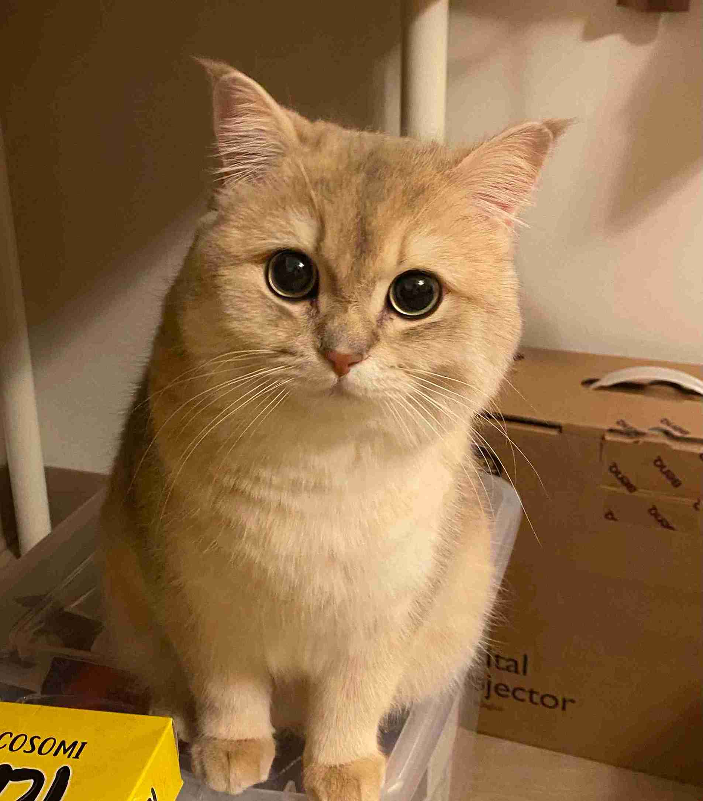
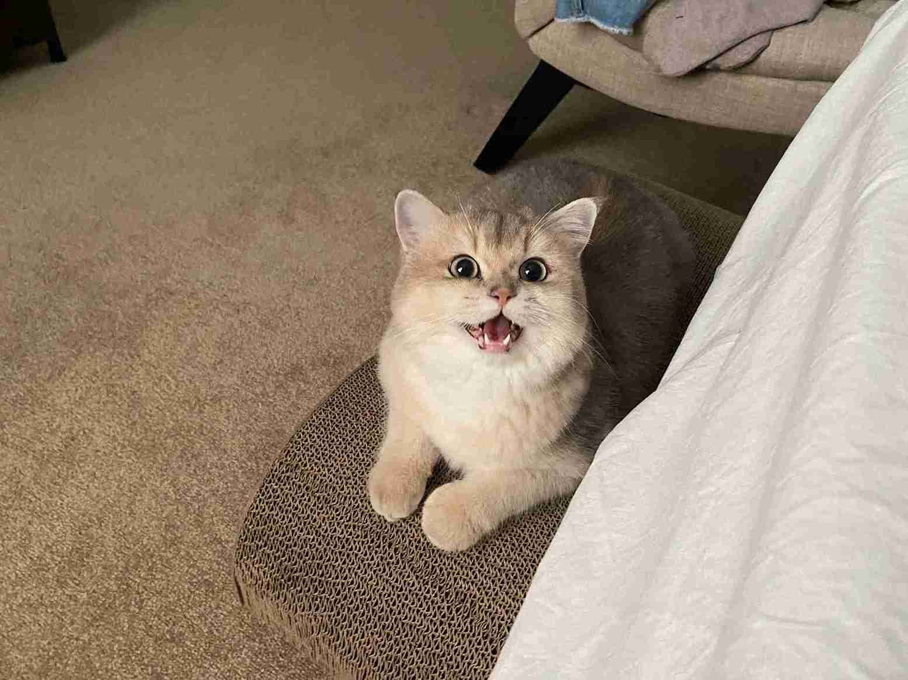

* I have a cat. His English name is Crusoe, and his Chinese name is Suan Tou (garlic). Here are some photos of him.

* I like classical music. I particularly enjoy works from the Romantic period. My favorite composer is Beethoven; his works are always passionate and full of idealism. I especially love his Fifth and Ninth Symphonies, his Fifth Piano Concerto, and his Violin Concerto. My favorite piano composer is Chopin; his works are incredibly emotional. I particularly enjoy his First and Third Ballades, Barcarolle, First Piano Concerto, Heroic Polonaise, and the Grand Polonaise Brillante. Additionally, I also appreciate the Russian grandeur and introspection in Rachmaninoff's works, particularly his Second and Third Piano Concertos.
* I have been playing the piano since 6 years old. I passed the amateur level 10 piano exam at the Shanghai Conservatory of Music in 2012. During high school, I served as the piano accompanist for my class's choir and poetry recitations. Since high school, the pieces I have practiced most frequently are Chopin's Heroic Polonaise in A-flat major, Op. 53, Nocturne in E Flat, Op. 9 No. 2, and Liszt's Hungarian Rhapsody No. 11. I have also self-taught myself some pieces. Here is an audio of Étude Op. 10, No. 3 (Farewell) by Frédéric Chopin that I played in 2019.
<video width="300" height="50" controls>
    <source src="../videos/etude.mp4" type="video/mp4">
</video>
