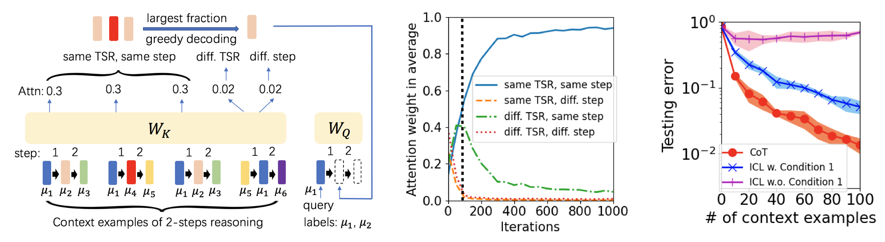

Large-scale foundation models, like GPT-3, GPT-4, and LLaMa have achieved remarkable empirical success in language, vision, and multi-modal processing. However, the theoretical understanding of these models is less investigated, which hinders the design and development of advanced neural architectures and time- and sample-efficient training and inference algorithms. My recent research projects focus on the theoretical analysis of modern neural models, especially the **Generalization and optimization theory of Transformer-based models**.

------
## Task Vector for Model Editing: A Generalization Analysis

**Background**: Chain-of-Thought (CoT) is an efficient prompting method that enables the reasoning ability of large language models by augmenting the query with multiple examples that contain multiple intermediate steps. Despite the empirical success, the theoretical understanding of how to train a Transformer to achieve the CoT ability remains less explored. This project mainly studies: 
<b><em>Why can a Transformer be trained to generalize on multi-step reasoning tasks via CoT?</em></b>

**Contribution**: This work is the first theoretical generalization analysis of task arithmetic on a nonlinear Transformer model for multi-task learning, unlearning, and out-of-domain generalization. The technical contributions include:

1. We theoretically analyze the training dynamics on a one-layer single-head attention-only Transformer and quantify the required number of context examples in each training sample, the total number of training samples, and the number of training iterations needed to acquire CoT ability. We illustrate that Transformers implement CoT by attending to the context examples with the same input patterns as the query during each reasoning step.
2. We characterize the required number of context examples in the testing prompt for successful CoT reasoning when noise and error exist in contexts. Our quantitative bounds are consistent with the intuition that more accurate context examples and more similar examples to the query improve CoT accuracy.
3. We provide a quantitative analysis of the requirements for successful ICL reasoning with our studied trained model. We show that
successful ICL requires an additional condition (Condition 1) that the prompt has a dominant number of correct input-label examples, while the success of CoT does not depend on this condition. This can be viewed as one of the possible reasons why CoT outperforms ICL. 

**Publication**: _**Hongkang Li**_, _Yihua Zhang_, _Shuai Zhang_, _Pin-Yu Chen_, _Sijia Liu_, _Meng Wang_. [When is Task Vector Provably Effective for Model Editing? A Generalization Analysis of Nonlinear Transformers](https://arxiv.org/pdf/2504.10957). _ICLR 2025 **Oral**_. [slides](https://lohek330.github.io/lihongkang.github.io/files/tv_slides.pdf)

------
## Training Nonlinear Transformers for Chain-of-Thought Generalization

**Background**: Chain-of-Thought (CoT) is an efficient prompting method that enables the reasoning ability of large language models by augmenting the query with multiple examples that contain multiple intermediate steps. Despite the empirical success, the theoretical understanding of how to train a Transformer to achieve the CoT ability remains less explored. This project mainly studies: 
<b><em>Why can a Transformer be trained to generalize on multi-step reasoning tasks via CoT?</em></b>

**Contribution**: We make the following contributions in this work:

1. We theoretically analyze the training dynamics on a one-layer single-head attention-only Transformer and quantify the required number of context examples in each training sample, the total number of training samples, and the number of training iterations needed to acquire CoT ability. We illustrate that Transformers implement CoT by attending to the context examples with the same input patterns as the query during each reasoning step.
2. We characterize the required number of context examples in the testing prompt for successful CoT reasoning when noise and error exist in contexts. Our quantitative bounds are consistent with the intuition that more accurate context examples and more similar examples to the query improve CoT accuracy.
3. We provide a quantitative analysis of the requirements for successful ICL reasoning with our studied trained model. We show that
successful ICL requires an additional condition (Condition 1) that the prompt has a dominant number of correct input-label examples, while the success of CoT does not depend on this condition. This can be viewed as one of the possible reasons why CoT outperforms ICL. 

**Publication**: _**Hongkang Li**_, _Songtao Lu_, _Pin-Yu Chen_, _Xiaodong Cui_, _Meng Wang_. [Training Nonlinear Transformers for Chain-of-Thought Inference: A Theoretical Generalization Analysis](https://arxiv.org/abs/2410.02167). _ICLR 2025_. [long slides](https://lohek330.github.io/lihongkang.github.io/files/cot_ibm_slides.pdf)

------
## The Learning and Generalization of Nonlinear Transformers in In-Context Learning

**Background**: In-context learning (ICL) is an impressive capability of Transformer-based large language models (LLM), where a pre-trained LLM can make inferences in new tasks without fine-tuning by simply augmenting the query with some input-output examples from that task. Due to the technical challenges of analyzing the nonconvex training problem from the nonlinearity in Transformers, the mechanics of how nonlinear Transformers learn and generalize in ICL remains to be explored. Briefly speaking, this project aims to study this problem: 
<b><em>How can a Transformer be trained to perform ICL and generalize in/out of domain successfully and efficiently?</em></b>

**Contribution**: This work makes the following contributions:

1. We theoretically characterize the training dynamics of Transformers with nonlinear self-attention and nonlinear MLP, together with the resulting model's ICL generalization capability on the tasks unseen in training with and without data distribution shifts. We quantify how the ICL generalization performance is affected by the fraction of context examples with the same relevant pattern as the testing query. 
2. We expand the theoretical understanding of the mechanism of the ICL capability of nonlinear Transformers. That is, the attention weights are concentrated on contexts that share the same relevant pattern as the query. Then, the ReLU MLP layer promotes the label embedding of these examples, thus making the correct prediction for the query. The following figure illustrates the mechanism we characterize based on our formulated data. 

3. Given the ICL mechanism, we theoretically justify the validity of magnitude-based pruning in preserving ICL. We conclude that pruning neurons with a small magnitude has little effect on the generalization.

**Publication**: _**Hongkang Li**_, _Meng Wang_, _Songtao Lu_, _Xiaodong Cui_, _Pin-Yu Chen_. [How Do Nonlinear Transformers Learn and Generalize in In-Context Learning](https://arxiv.org/pdf/2402.15607). _ICML 2024_. [long slides](https://lohek330.github.io/lihongkang.github.io/files/icl_ibm_slides.pdf)

------
## Generalization of Graph Transformers: the Impact of Self-Attention and Positional Encoding

**Background**: Graph Transformers (GT), which incorporates self-attention and positional encoding, is a novel and powerful architecture for graph learning. However, it is challenging to establish a theoretical foundation for learning and generalization because of the complex nonconvex interactions across layers and the recursive graph structure. The goal of this project is to explain the following questions:

<b><em>Under what conditions can a Graph Transformer achieve desired generalization?</em></b>

<b><em>What is the advantage of self-attention and positional encoding in graph learning?</em></b>

**Contributions**: This work makes the following contributions based on the GT architecture and the graph data (an example) formulated below:

1. We establish a novel and extendable framework for the optimization and generalization analysis of shallow GTs, while the state-of-the-art theoretical works on graph neural networks exclude attention layers.
2. We theoretically characterize the benefits of the self-attention layer of GTs. That is, the self-attention evolves in a way that promotes class-relevant nodes during training, which leads to a sparse trained attention map.
3. We demonstrate that the trainable positional embedding improves the generalization by promoting the nodes in the core neighborhood, which reduces the training iterations and sample complexity. The following figure (Figure 8 in the publication below) shows the success of positional encoding in indicating the core neighborhood for graph learning and motivating graph sampling methods for GT: for every distance $$z$$, the trend of values of positional encoding $$b_z$$ is aligned with PE-based sampling, i.e., only using the distance-$$z$$ neighborhood for training. The results are verified by three real-world datasets: PubMed (homophilous graph), Actor (heterophilous graph), and PascalVOC-SP-1G (long-range graph).

**Publication**: _**Hongkang Li**_, _Meng Wang_, _Tengfei Ma_, _Sijia Liu_, _Zaixi Zhang_, _Pin-Yu Chen_. [What Improves the Generalization of Graph Transformers? A Theoretical Dive into the Self-attention and Positional Encoding](https://arxiv.org/pdf/2406.01977). _ICML 2024_.

------
## Learning, Generalization, and Sample Complexity of Vision Transformers

**Background**: Vision Transformers (ViTs) with self-attention modules have achieved great empirical success in many vision tasks. However, theoretical learning and generalization analysis is mostly elusive. This project tries to answer the following question:

<b><em>Under what conditions does a Transformer achieve satisfactory generalization?</em></b>

**Contributions**: This work makes the following contributions.

1. We propose a new analytical framework to tackle the non-convex optimization and generalization for a one-layer ViT, which includes one self-attention layer followed by a two-layer perceptron, for a classification task. This is more challenging than previous works on conventional neural networks without self-attention layers.
2. We theoretically depict the evolution of the attention map during the training and characterize how “attention” is paid to different tokens during the training. Specifically, we show that under the structured data model, the learning parameters of the self-attention module grow in the direction that projects the data to the label-relevant patterns, resulting in an increasingly sparse attention map. The left figure below justifies that the attention weights are concentrated on label-relevant patterns after training.
3. We provide a theoretical explanation for the improved generalization using token sparsification. On one hand, if a token sparsification method can remove class-irrelevant and/or highly noisy tokens, then the sample complexity is reduced while achieving the same testing accuracy. This is verified by synthetic data in the middle figure below. On the other hand, token sparsification can also remove spurious correlations to improve the testing accuracy. This is shown by the right figure below on a dataset generated by CIFAR-10 and IMAGENET Plants synset, where increasing $$\alpha_*$$ means removing spurious correlations. Then, one can observe that the testing performance is improved if the spurious correlations are reduced in both initial models pre-trained from CIFAR-100 and modified CIFAR-10, respectively.

