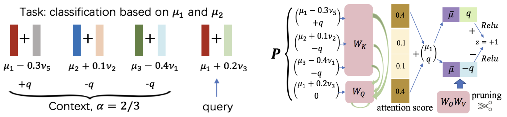

Large-scale foundation models, like GPT-3, GPT-4, and LLaMa have achieved remarkable empirical success in language, vision, and multi-modal processing. However, the theoretical understanding of these models is less investigated, which hinders the design and development of advanced neural architectures and time- and sample-efficient training and inference algorithms. My recent research projects focus on the theoretical analysis of modern neural models, especially the **Generalization and optimization theory of Transformer-based models**.

------
## The Learning and Generalization of Nonlinear Transformers in In-Context Learning

**Background**: In-context learning (ICL) is an impressive capability of Transformer-based large language models (LLM), where a pre-trained LLM can make inferences in new tasks without fine-tuning by simply augmenting the query with some input-output examples from that task. Due to the technical challenges of analyzing the nonconvex training problem from the nonlinearity in Transformers, the mechanics of how nonlinear Transformers learn and generalize in ICL remains to be explored. Briefly speaking, this project aims to study this problem: 
<b><em>How can a Transformer be trained to perform ICL and generalize in/out of domain successfully and efficiently?</em></b>

**Contribution**: This work makes the following contributions:

1. We theoretically characterize the training dynamics of Transformers with nonlinear self-attention and nonlinear MLP, together with the resulting model's ICL generalization capability on the tasks unseen in training with and without data distribution shifts. We quantify how the ICL generalization performance is affected by the fraction of context examples with the same relevant pattern as the testing query. 
2. We expand the theoretical understanding of the mechanism of the ICL capability of nonlinear Transformers. That is, the attention weights are concentrated on contexts that share the same relevant pattern as the query. Then, the ReLU MLP layer promotes the label embedding of these examples, thus making the correct prediction for the query. The following figure illustrates the mechanism we characterize based on our formulated data. 

3. Given the ICL mechanism, we theoretically justify the validity of magnitude-based pruning in preserving ICL. We conclude that pruning neurons with a small magnitude has little effect on the generalization.

**Publication**: _**Hongkang Li**_, _Meng Wang_, _Songtao Lu_, _Xiaodong Cui_, _Pin-Yu Chen_. [How Do Nonlinear Transformers Learn and Generalize in In-Context Learning](https://arxiv.org/pdf/2402.15607). _ICML 2024_. [long slides](https://lohek330.github.io/lihongkang.github.io/files/icl_ibm_slides.pdf)

------
## Generalization of Graph Transformers: the Impact of Self-Attention and Positional Encoding

**Background**: Graph Transformers (GT), which incorporates self-attention and positional encoding, is a novel and powerful architecture for graph learning. However, it is challenging to establish a theoretical foundation for learning and generalization because of the complex nonconvex interactions across layers and the recursive graph structure. The goal of this project is to explain the following questions:

<b><em>Under what conditions can a Graph Transformer achieve desired generalization?</em></b>

<b><em>What is the advantage of self-attention and positional encoding in graph learning?</em></b>

**Contributions**: This work makes the following contributions based on the GT architecture and the graph data (an example) formulated below:

1. We establish a novel and extendable framework for the optimization and generalization analysis of shallow GTs, while the state-of-the-art theoretical works on graph neural networks exclude attention layers. 
